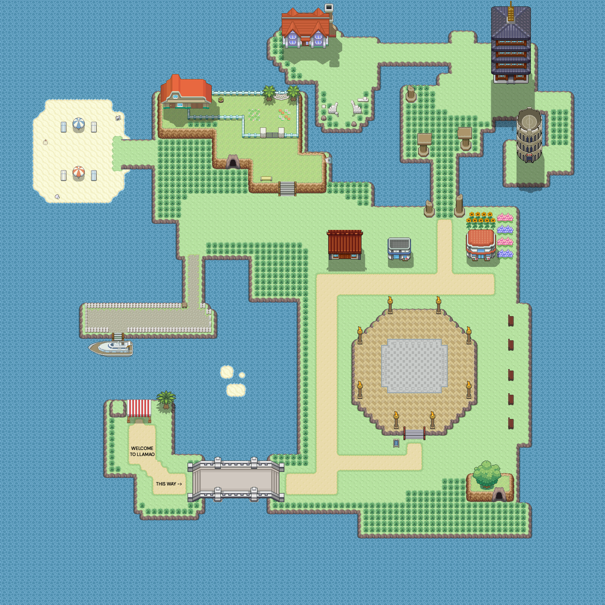
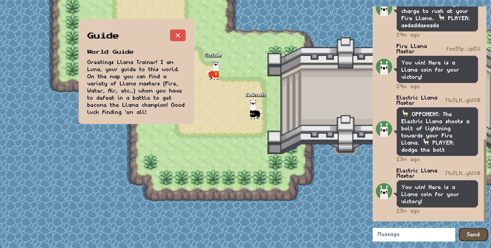
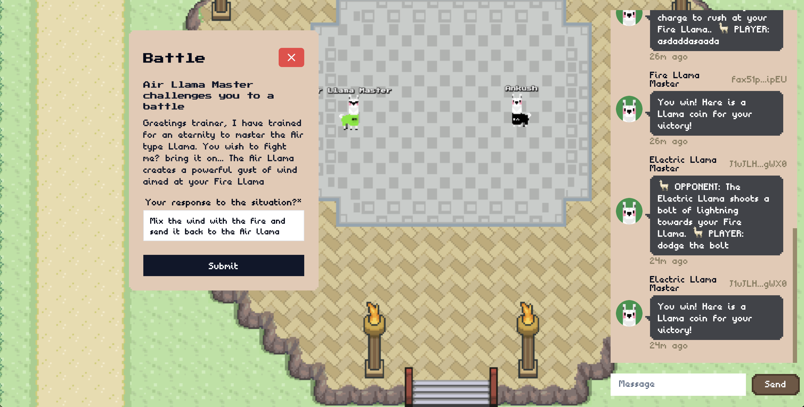
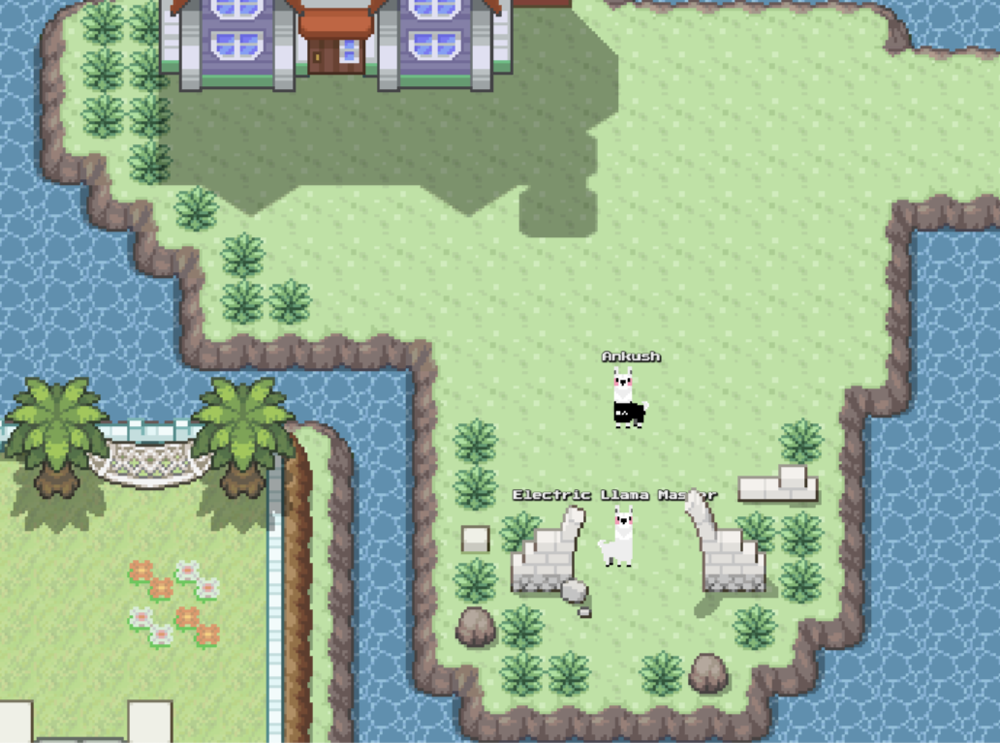

# Llamamon Reality World

Submission for [aoTheComputer](https:/x.com/aoTheComputer) Reality Protocol world quest

## Description

This is an attempt to recreate the p###mon style GBA games on the reality protocol, where every player, every entity, every interaction, every battle exists on the Arweave protocol and computation is done on aoTheComputer.

## Screenshots

Click to expand

## How to play

Visit https://reality-viewer.arweave.net/#/LyaolZK47aoDyQjuUM5DEhwpSJQLKYr7eOQYzgslwhI and login with an Arweave wallet

## Run your own world

> PRO TIP: Open the project with BetterIDEa IDE for quick and easy setup:

Just create a new project and upload the files in the `src` directory, then run the following lua files in order:
- dbadmin.lua
- llama-herder.lua
- main.lua
- world-template.lua
- chat.lua

> For aos cli users just clone the repo and run the files

---

- Positions for Llama NPCs are in `world-template.lua`
- Editable world map is in `assets/Primary.json`
- World Tileset is in `assets/Primary.png`

---

For every Llama NPC you need to spawn a different process and load a file from the `src/llamas` directory, then copy its process id and paste in the `world-template.lua` `RealityEntitiesStatic` variable

>The IDE makes it easier to use multiple processes for different files at the same time. Just checkout `File Processes` under settings

---

To edit the world, open it in Tiled and export it as a JSON file, then upload the JSON file to Arweave and replace the Tilemap TxId in `world-template.lua`s `RealityParameters` variable

## Tileset

[Deviant Art](https://www.deviantart.com/chaoticcherrycake/art/Pokemon-Tileset-From-Public-Tiles-358379026)

[Credits](https://www.deviantart.com/chaoticcherrycake/journal/Credits-for-Tiles-367931482)